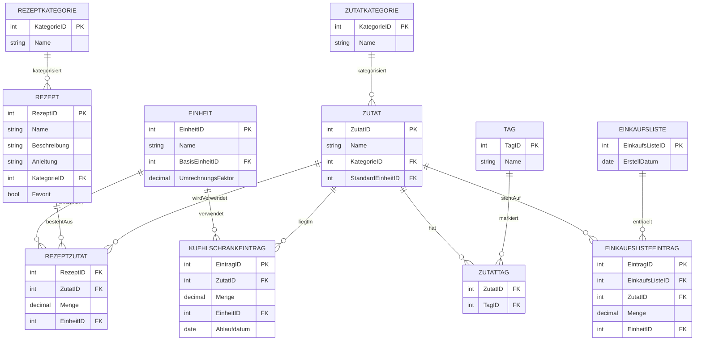
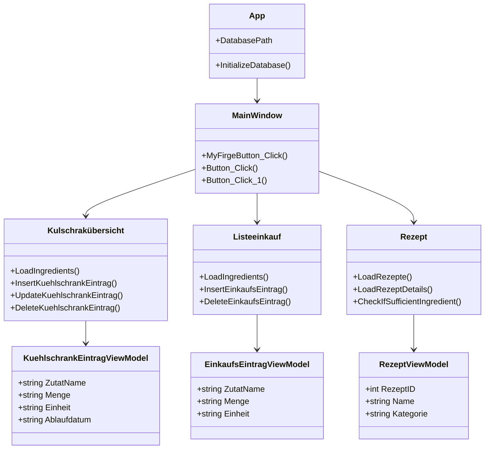

# Projekt-Dokumentation

## 1. Projektübersicht

### Projektname
Smart Koch App

### Projektziel
Die Anwendung unterstützt den Benutzer bei der Verwaltung von Lebensmitteln im Kühlschrank, der Planung von Rezepten sowie der Erstellung von Einkaufslisten. Ziel ist es, den Alltag beim Kochen zu vereinfachen, Lebensmittelverschwendung zu reduzieren und Mahlzeiten gezielt zu planen.

### Problemstellung
Viele Nutzer haben Schwierigkeiten, ihre vorhandenen Lebensmittel sinnvoll zu nutzen, Rezepte passend auszuwählen und benötigte Zutaten rechtzeitig zu ergänzen. Die Anwendung soll diese Prozesse zentral und einfach gestalten.

### Nutzen der Anwendung
- Übersicht über verfügbare Zutaten
- einfache Rezeptauswahl
- Prüfung, ob benötigte Zutaten vorhanden sind
- Erstellung und Verwaltung von Einkaufslisten
- Speicherung aller Daten dauerhaft in einer lokalen SQLite-Datenbank

---

## 2. Funktionale Anforderungen

Die Anwendung soll folgende Funktionen bereitstellen:

### 2.1 Kühlschrankverwaltung
- Verwaltung von Zutaten und Mengen
- Eingabe von Ablaufdaten
- Anzeige von Zutaten mit ihren Eigenschaften
- Bearbeitung und Löschen von Einträgen

### 2.2 Rezeptverwaltung
- Anzeige aller verfügbaren Rezepte
- Darstellung von Rezeptdetails inklusive Beschreibung und Anleitung
- Anzeige der benötigten Zutaten pro Rezept
- Prüfung, ob ausreichende Zutaten vorhanden sind

### 2.3 Einkaufsliste
- Verwaltung von Einkaufseinträgen
- Auswahl von Zutaten und Mengen
- Speichern und Anzeigen der Liste
- Löschen einzelner Einträge

### 2.4 Datenpersistenz
- Speicherung aller relevanten Daten in einer SQLite-Datenbank
- Automatische Initialisierung der Datenbank beim Start der Anwendung
- Einfügen von Beispieldaten beim ersten Start

### 2.5 Fehlerbehandlung und Validierung
- Fehlermeldungen bei Datenbankproblemen
- Prüfung auf leere oder ungültige Eingaben
- Benutzerfreundliche Hinweise bei fehlerhaften Operationen

---

## 3. Nichtfunktionale Anforderungen

- Die Anwendung wird in C# mit WPF entwickelt.
- Die Datenbank wird mit SQLite umgesetzt.
- Der Quellcode wird über Git versioniert verwaltet.
- Die Dokumentation wird im Repository als Markdown-Dateien geführt.
- Die Anwendung soll nachvollziehbar, modular und erweiterbar aufgebaut sein.

---

## 4. Technische Umsetzung

### 4.1 Programmiersprache und Framework
- C#
- Windows Presentation Foundation (WPF)
- .NET Framework / Visual Studio-Projektstruktur

### 4.2 Datenbank
- SQLite als lokale Datenbank
- Verbindung über System.Data.SQLite
- Datenbankdatei wird automatisch erzeugt, falls sie noch nicht existiert

### 4.3 Projektstruktur
- Datenbank: SQL-Skripte für Initialisierung und Beispiel-Daten
- Wpf: Hauptanwendung mit Fenstern für Kühlschrank, Rezepte und Einkaufsliste
- Dokumente: Projektbeschreibung, Dokumentation und Projektjournal

### 4.4 Wichtige Komponenten der Anwendung
- MainWindow: Startfenster mit Navigation zu den Hauptbereichen
- Kulschrakübersicht: Verwaltung der Kühlschrankeinträge
- Listeeinkauf: Verwaltung der Einkaufsliste
- rezept: Anzeige und Prüfung von Rezepten
- App: Initialisiert die Datenbank beim Start

---

## 5. Datenbankmodell

### 5.1 ER-Modell

### 5.2 Relationales Modell
Die Tabellen sind in relationaler Form wie folgt organisiert:
- Zutat(ZutatID, Name, KategorieID, StandardEinheitID)
- KuehlschrankEintrag(EintragID, ZutatID, Menge, EinheitID, Ablaufdatum)
- Rezept(RezeptID, Name, Beschreibung, Anleitung, KategorieID, Favorit)
- RezeptZutat(RezeptID, ZutatID, Menge, EinheitID)
- Einheit(EinheitID, Name, BasisEinheitID, UmrechnungsFaktor)
- ZutatKategorie(KategorieID, Name)
- RezeptKategorie(KategorieID, Name)
- Tag(TagID, Name)
- ZutatTag(ZutatID, TagID)
- EinkaufsListe(EinkaufsListeID, ErstellDatum)
- EinkaufsListeEintrag(EintragID, EinkaufsListeID, ZutatID, Menge, EinheitID)

### 5.3 Tabellenbeschreibung

| Tabelle | Zweck |
|---|---|
| Zutat | Speichert alle verfügbaren Zutaten |
| KuehlschrankEintrag | Speichert den Bestand im Kühlschrank |
| Rezept | Speichert Rezepte mit Beschreibung und Anleitung |
| RezeptZutat | Verknüpft Rezepte mit Zutaten und Mengen |
| Einheit | Definiert Einheiten und Umrechnungsfaktoren |
| EinkaufsListe | Speichert Einkaufslisten |
| EinkaufsListeEintrag | Enthält die einzelnen Positionen einer Einkaufsliste |

---

## 6. OOP- und Architekturkonzept

### 6.1 Objektorientierte Umsetzung
Die Anwendung verwendet objektorientierte Prinzipien über die Fensterklassen und Datenmodellklassen. Dazu zählen:
- Klassen für die GUI-Fenster
- Objekte für die Darstellung von Rezepten und Einträgen
- getrennte Datenstruktur für die Anzeige in der Oberfläche

### 6.2 Aktuelle Struktur im Projekt
Die Anwendung verwendet derzeit bereits konkrete Klassen und Objekte, insbesondere:
- MainWindow
- Kulschrakübersicht
- Listeeinkauf
- Rezept
- RezeptViewModel
- KuehlschrankEintragViewModel
- EinkaufsEintragViewModel

### 6.3 Erweiterungsziel für die Module
Im Sinne der Aufgabenstellung sind folgende OOP-Konzepte als Zielstruktur vorgesehen:
- Vererbung über gemeinsame Basisklassen für Datenobjekte oder Fenster
- Polymorphismus durch unterschiedliche Implementierungen einer gemeinsamen Schnittstelle
- Abstraktion über zentrale Datenbank- und Validierungslogik
- Interfaces für die Trennung von Datenzugriff und UI-Logik

---

## 7. Datenbankzugriff und CRUD-Operationen

Die Anwendung verwendet CRUD-Operationen für die Datenverwaltung:

- Create: neue Einträge im Kühlschrank, neue Einkaufsliste-Positionen, neue Rezepte
- Read: Laden von Zutaten, Rezepten und Listen
- Update: Bearbeitung von Mengen, Einheiten und Ablaufdaten
- Delete: Entfernen von Einträgen und Listenpositionen

### Beispielhafte Datenbankoperationen
- Auswahl aller Rezepte mit zugehöriger Kategorie
- Laden aller Zutaten für die Anzeige in den ComboBoxen
- Einfügen von Kühlschrank-Einträgen
- Aktualisieren von Mengen und Ablaufdaten
- Löschen von Einträgen aus der Einkaufsliste

---

## 8. Datenbankinitialisierung und Beispiel-Daten

Beim Start der Anwendung wird geprüft, ob die Datei der SQLite-Datenbank bereits existiert.

### Ablauf der Initialisierung
1. Prüfung, ob die Datenbankdatei vorhanden ist
2. Erzeugung der Datenbank, falls sie fehlt
3. Ausführung des Initialisierungsskripts
4. Einfügen von Beispieldaten, falls die Datenbank neu angelegt wurde

### Skriptstruktur
- Init.sql: Erzeugung aller Tabellen und Beziehungen
- Insert.sql: Einfügen von Basiskategorien, Einheiten, Zutaten, Rezepten und Listen

---

## 9. Benutzeroberfläche

Die Anwendung besitzt eine einfache und klare WPF-Oberfläche mit mehreren Fenstern:
- Startseite mit Navigation
- Kühlschrankübersicht zur Pflege der Bestände
- Rezeptansicht zur Darstellung von Rezepten und deren Zutaten
- Einkaufsliste zur Verwaltung der benötigten Zutaten

Die Oberfläche soll benutzerfreundlich gestaltet sein, mit klaren Buttons, Formularfeldern und informativen Meldungen.

---

## 10. Ablaufplan und Projektorganisation

### 10.1 Zeitplan

| Zeitraum | Ziel |
|---|---|
| Januar | Projektplanung, Anforderungsanalyse, Datenbankkonzept |
| Februar | ER-Modell, relationales Modell, erste Datenbankstruktur |
| März | Umsetzung der Basisfunktionen und Datenbankzugriffe |
| April | Erweiterung der Funktionalität und UI-Elemente |
| Mai | OOP-Umsetzung, Fehlerbehebung, Tests |
| Juni | Finalisierung, Dokumentation, Präsentation |

### 10.2 Wichtige Meilensteine
- Erstellung eines ER-Modells
- Erstellung eines relationalen Modells
- Erstellung der Datenbankstruktur
- Erstellung der Anwendung mit CRUD-Funktionen
- Dokumentation und Abschlusspräsentation

---

## 11. Testkonzept

### 11.1 Ziel der Tests
Die Tests sollen sicherstellen, dass die Datenbankoperationen korrekt funktionieren und die Anwendung stabil arbeitet.

### 11.2 Testarten
- Funktionstests für Datenbankzugriffe
- GUI-Tests für die wichtigsten Abläufe
- Test der Fehlerbehandlung bei ungültigen Eingaben
- Prüfung der Initialisierung der Datenbank

### 11.3 Hinweise zur Testdurchführung
- Start der Anwendung mit einer frischen Datenbank
- Einfügen von Testdaten
- Prüfung von Einfügen, Lesen, Aktualisieren und Löschen
- Verifikation der Fehlermeldungen bei fehlerhaften Eingaben

---

## 12. Installations- und Ausführungsanleitung

### Voraussetzungen
- Windows-Betriebssystem
- Visual Studio mit WPF-Unterstützung
- Zugriff auf die NuGet-Pakete im Projektverzeichnis

### Schritte
1. Projektordner öffnen
2. Lösung starten
3. Projekt bauen
4. Anwendung ausführen
5. Beim ersten Start wird die SQLite-Datenbank automatisch angelegt

### Hinweise
Wenn die Datenbank nicht vorhanden ist, werden die SQL-Skripte automatisch verarbeitet. Die Anwendung kann danach direkt verwendet werden.

---

## 13. Git und Dokumentationspflege

- Der gesamte Quellcode wird in einem Git-Repository verwaltet.
- Änderungen werden nachvollziehbar dokumentiert.
- Markdown-Dateien werden für Anforderungen, Projektstatus und technische Dokumentation verwendet.
- Die Dokumentation soll stets mit dem aktuellen Projektstand synchron gehalten werden.

---

## 14. Fazit

Die Smart Koch App stellt eine praxisnahe WPF-Anwendung dar, die Zutatenverwaltung, Rezeptplanung und Einkaufsliste in einem gemeinsamen System vereint. Durch die Kombination aus C#, WPF und SQLite entsteht eine einfache, aber erweiterbare Lösung für den Alltag. Die Dokumentation bildet die Grundlage für die technische Umsetzung, die Datenbankstruktur und die Projektorganisation.

