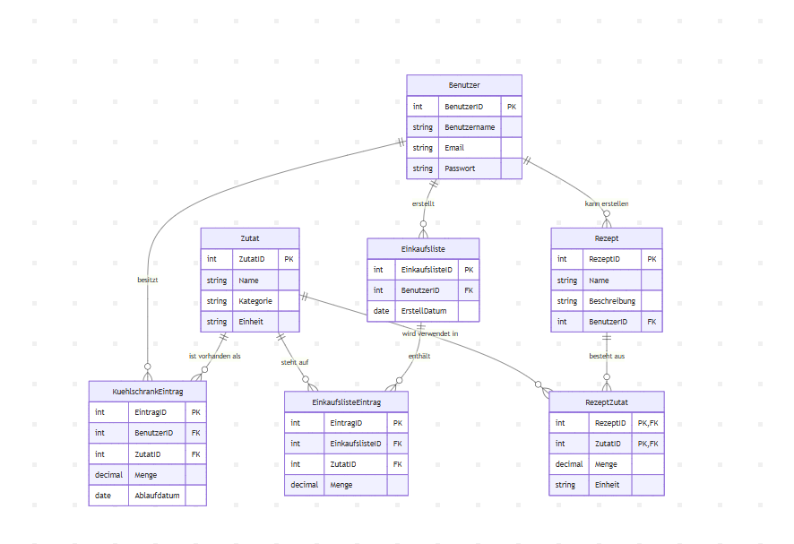

# Smart Koch App – Konzept

## Überblick

Die App dient zur Verwaltung von Lebensmitteln im Kühlschrank sowie zur Planung von Mahlzeiten.  
Sie unterstützt den Benutzer dabei, Lebensmittel rechtzeitig zu verbrauchen, Rezepte zu finden und automatisch Einkaufslisten zu erstellen.

## Ziel der App

* Kochplanung vereinfachen
* Lebensmittelverschwendung reduzieren
* Inspiration und schnelle Rezeptideen liefern

### Kühlschrankverwaltung

In der App werden gespeichert:

* Inhalt des Kühlschranks des Benutzers
* Ablaufdatum der einzelnen Lebensmittel
* Mengenangaben

### Rezeptverwaltung

Die App enthält:

* Eine Liste von Rezepten
* Schritt-für-Schritt Anleitungen
* Benötigte Zutaten pro Rezept
* Kategorien (z. B. vegetarisch, Dessert)

### Automatische Einkaufslisten

Die App kann automatisch Einkaufslisten generieren:

* Basierend auf ausgewählten Rezepten
* Basierend auf fehlenden Zutaten

### Rezeptvorschläge

Die App schlägt Rezepte vor basierend auf:

* Lebensmitteln, die bereits vorhanden sind
* Lebensmitteln, die bald ablaufen
* Optional: Benutzerpräferenzen

## Technische Umsetzung

### Programmiersprache & Framework

* **WPF (Windows Presentation Foundation)**
* **C#**

### Datenbank

* **SQLite** (lokale Datenbank)

## Projektplan (12 Wochen)

| Woche | Haupthema | Zoe | Gian | Kenan | Mögliche Ereignisse | Aufgaben nach Situation |
|-------|-----------|-----|------|-------|-------------------|------------------------|
| 1     | Organisation | Gleich | Gleich | Gleich | Liste von Funktionalitäten | Log führen |
| 2     | SQL | Mock-up für WPF | Datenbank erstellen (Grundgerüst) | Datenbank erstellen (Grundgerüst) | Team Brainstorming | Log führen |
| 3     | SQL | WPF Design (Kühlschrankverwaltung) | Insert DB | Update DB | Updates bei DB | Log führen |
| 4     | SQL | WPF Design (Kühlschrankverwaltung + Rezeptverwaltung) weitermachen | Basic Funktionen in DB anfangen | Update DB finalisieren wenn nötig (falls fertig ER-Modell) | WPF Update von Zoe | Log führen |
| 5     | SQL | C# mit SQLite verbinden | C# mit SQLite verbinden | C# mit SQLite verbinden | Zusammenarbeit | Log führen |
| 6     | Mischung | WPF Design (Rezeptverwaltung) | Beginn mit C# | ER-Modell finalisieren + Relationales Modell | Mögliche Ereignisse | Log führen |
| 7     | C# | WPF Design (Automatische Einkaufslisten) | Weiter mit C# | Aushelfen | – | Log führen |
| 8     | C# | WPF Design (Rezept) | noch nicht sicher (flexibel) | Aushelfen | – | Log führen |
| 9     | C# | Aushilfe mit C# | Grundfunktionen C# fertigstellen | Aushelfen | – | Log führen |
| 10    | C# | Aushilfe mit C# | evt. Zusatzfunktionen | Aushelfen | – | Log führen |
| 11    | C# | WPF Anpassen falls nötig | Fehler beheben | Fehler beheben | – | Log führen |
| 12    | C# | WPF Anpassen falls nötig | Fehler beheben | Presentation | – | Log führen |

