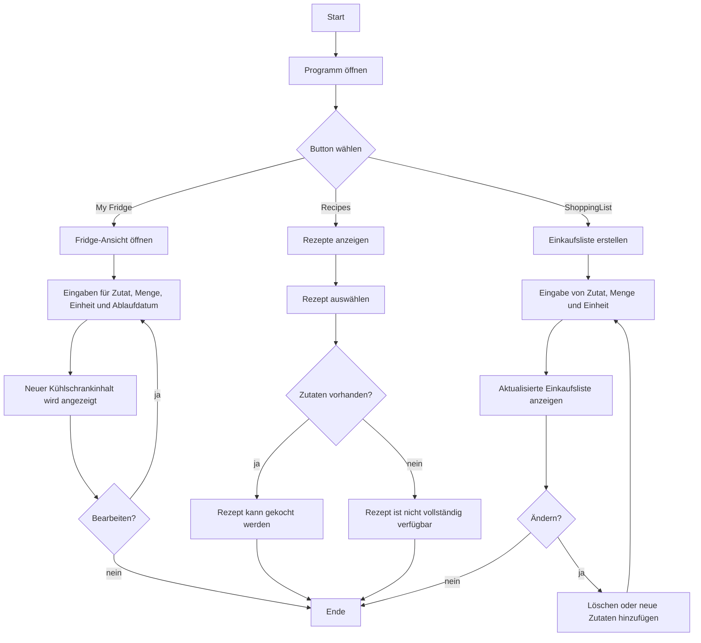

# IPT6.1_Rezept_planer

Ein modernes WPF-Projekt zur Verwaltung von Rezepten, Lebensmitteln und Einkaufslistsen.

## Überblick

Die Smart Koch App unterstützt Nutzer dabei, Lebensmittel im Kühlschrank übersichtlich zu verwalten, Rezepte zu entdecken und passende Einkaufsliste zu erstellen. Ziel ist es, den Alltag beim Kochen zu vereinfachen und Lebensmittelverschwendung zu reduzieren.

## Projektziel

Die Anwendung soll eine benutzerfreundliche Lösung für folgende Aufgaben bieten:

- Verwaltung von Zutaten und deren Ablaufdaten
- Anzeige und Auswahl von Rezepten
- Prüfung, ob benötigte Zutaten vorhanden sind
- Erstellung und Pflege von Einkaufslisten
- Speicherung aller Daten in einer lokalen SQLite-Datenbank

## Hauptfunktionen

- Kühlschrankverwaltung mit Mengen, Einheiten und Ablaufdatum
- Rezeptübersicht mit Beschreibung, Anleitung und Zutatenliste
- Prüfung der Verfügbarkeit von Zutaten für ein Rezept
- Verwaltung von Einkaufseinträgen
- Automatische Datenbankinitialisierung beim ersten Start

## Technische Umsetzung

- Programmiersprache: C#
- Oberflächen-Technologie: WPF (Windows Presentation Foundation)
- Datenbank: SQLite
- Versionsverwaltung: Git
- Dokumentation: Markdown

## Projektstruktur

- [Datenbank](Datenbank/): SQL-Skripte zur Erstellung und Befüllung der Datenbank
- [Dokumente](Dokumente/): Projektbeschreibung, Dokumentation und Journal
- [Wpf IPT6.1_Rezept_planer/Wpf](Wpf%20IPT6.1_Rezept_planer/Wpf/): Hauptanwendung mit den Fenstern und der Logik

## Installation und Start

1. Repository klonen oder lokal öffnen.
2. Die Lösung unter [Wpf IPT6.1_Rezept_planer/Wpf IPT6.1_Rezept_planer.slnx](Wpf%20IPT6.1_Rezept_planer/Wpf%20IPT6.1_Rezept_planer.slnx) öffnen.
3. Das Projekt in Visual Studio bauen und starten.
4. Beim ersten Start wird die SQLite-Datenbank automatisch angelegt und mit Beispiel-Daten befüllt.

## Datenbank

Die Anwendung nutzt eine lokale SQLite-Datenbank. Beim Start wird geprüft, ob die Datenbank bereits vorhanden ist. Falls nicht, werden die SQL-Skripte aus dem Ordner [Datenbank](Datenbank/) automatisch angewendet.

## PAP-Programmablaufplan

Der Programmablaufplan ist als PAP-Datei verfügbar: [Dokumente/Rezept_Planer.pap](Dokumente/Rezept_Planer.pap)

## Dokumentation

Weitere Informationen finden sich in den folgenden Dateien:

- [Dokumente/Projektbeschreibung.md](Dokumente/Projektbeschreibung.md)
- [Dokumente/Dokumentation.md](Dokumente/Dokumentation.md)

## Team

- Gian
- Zoé
- Kenan

## Status

Das Projekt befindet sich in der Entwicklungs- und Dokumentationsphase und wird kontinuierlich erweitert.